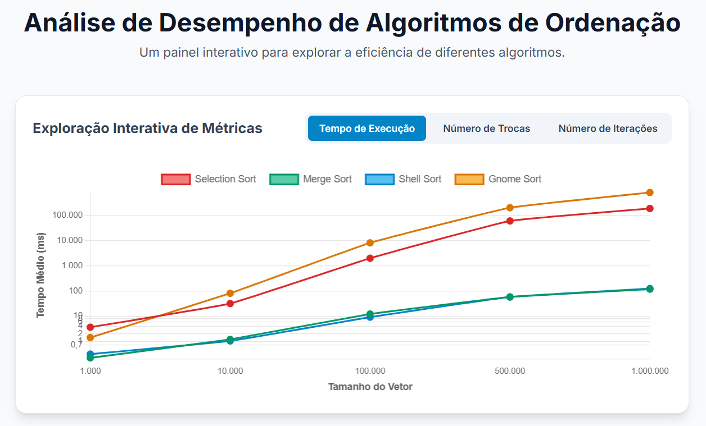

# 📊 Análise Comparativa de Algoritmos de Ordenação

Este projeto, desenvolvido para a disciplina de Estrutura de Dados, realiza uma análise empírica do desempenho de quatro algoritmos de ordenação: **Selection Sort**, **Merge Sort**, **Shell Sort** e **Gnome Sort**.

O objetivo é comparar a eficiência de cada algoritmo com base em três métricas principais:

- **Tempo de execução**
- **Número de trocas**
- **Número de iterações**

A análise foi conduzida com vetores de tamanhos variados, de 1.000 a 1.000.000 de elementos, para observar o comportamento e a escalabilidade de cada um.

---

## 🚀 Visualização Interativa dos Resultados

Para uma exploração completa e dinâmica dos resultados, desenvolvemos um **dashboard interativo**. Ele é a principal forma de visualizar e comparar os dados coletados.

<div align="center">
  
</div>

### **[Clique aqui para acessar o Dashboard de Análise](https://vmlof.github.io/Ordenacao-RA4-RPEC/)**

<br>


### Funcionalidades do Dashboard:

- **Gráfico Dinâmico:** Compare visualmente os algoritmos selecionando a métrica que deseja analisar (Tempo, Trocas ou Iterações).
- **Insights Rápidos:** Cards destacam os algoritmos com melhor e pior desempenho para cada métrica.
- **Detalhes dos Algoritmos:** Uma seção interativa com a descrição e a complexidade teórica de cada algoritmo.

---

## 🛠️ Como Executar o Projeto Localmente

### Pré-requisitos

- Java JDK 21 ou superior
- Uma IDE Java (IntelliJ, Eclipse, etc.)

### Passos para Executar a Análise

1.  **Clone o Repositório:**
    ```bash
    git clone https://github.com/vmlof/Ordenacao-RA4-RPEC.git
    ```
2.  **Abra o Projeto:**

    - Abra o projeto na sua IDE de preferência.

3.  **Execute o Código Java:**
    - Localize e execute a classe `AnalisaOrdem.java`.
    - O programa realizará todos os testes e gerará dois arquivos `.csv` na raiz do projeto com os resultados brutos e as médias:
        - `analise_algoritmos_completa.csv`
        - `tabela_comparativa.csv`

### Visualizando o Dashboard Localmente

- Após a execução, basta abrir o arquivo `index.html` em qualquer navegador web para acessar o painel interativo.

---

## 👥 Autores

- Paulo Vitor
- Brayan Calisto
